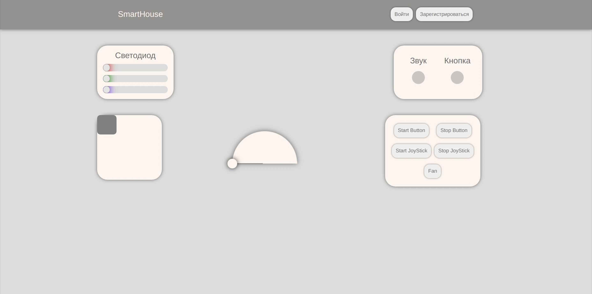

# Smart house

### Description

A simple Spring Java web server with Thymeleaf based UI for control over a set of Arduino sensors and mechanisms.

### Abilities
After connecting Arduino to the server the following actions can be performed:

- Turning light-emitting diode with the specified color and intensity
- Turning on sound alarm
- Registration of physical button clicks
- Registration and visualisation of physical joystick movements
- Rotation of a mechanical hand with a fan by 180 degrees
- Turning on the fan

### User Interface

### Intention
This project was made as a course work for SPSU "Introduction to Arduino" course
